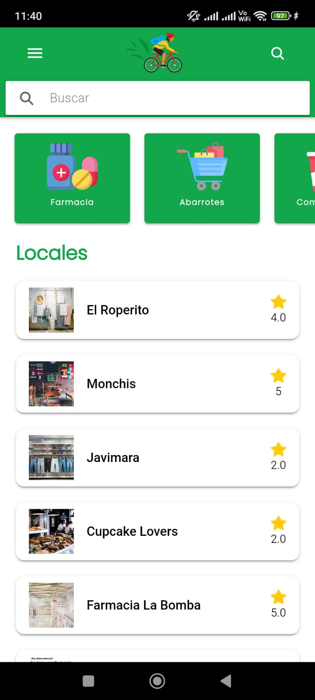
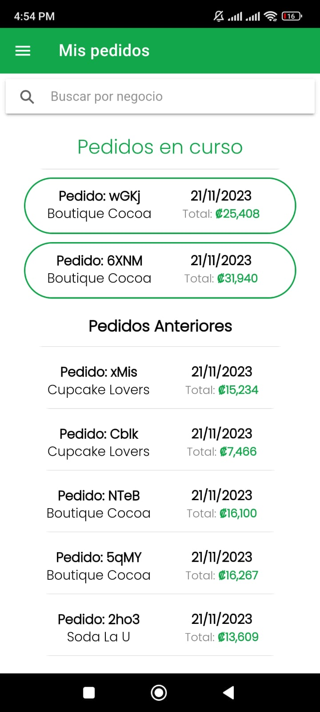
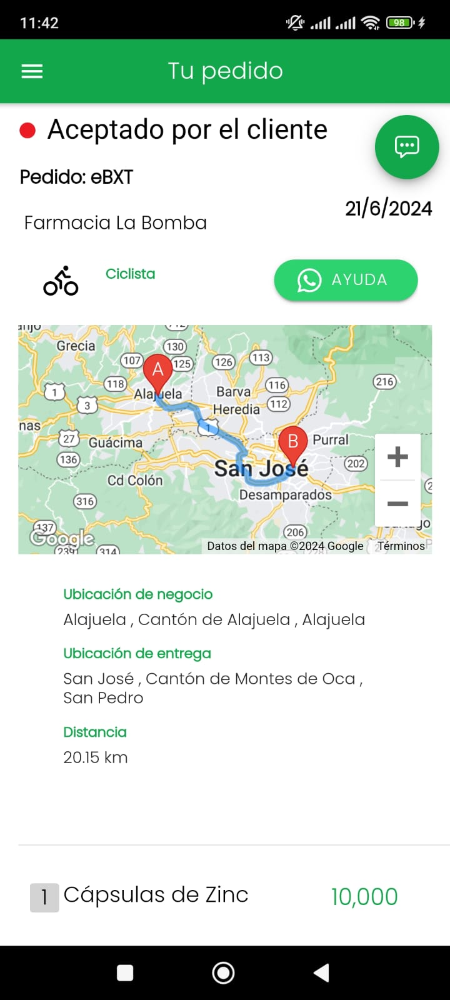
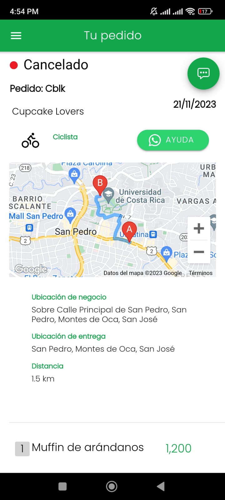
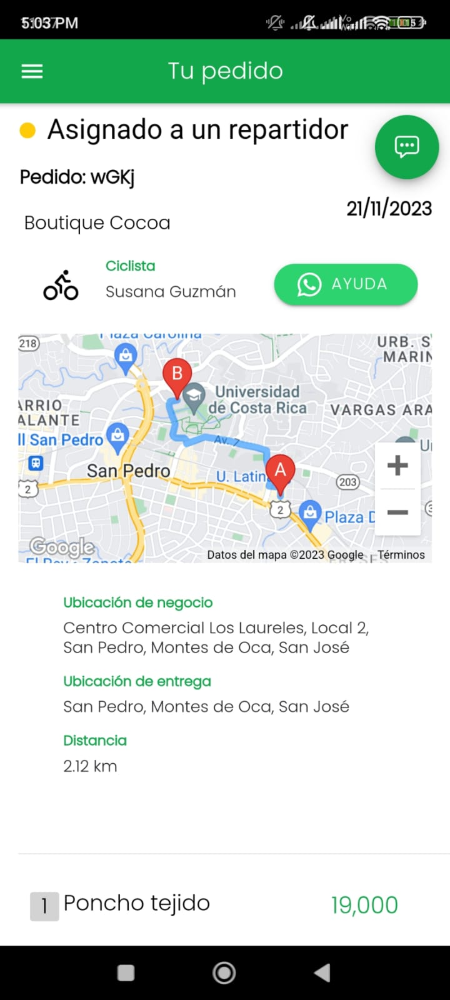
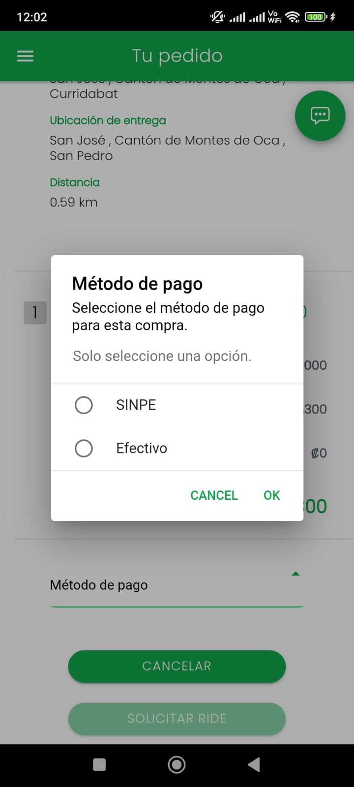
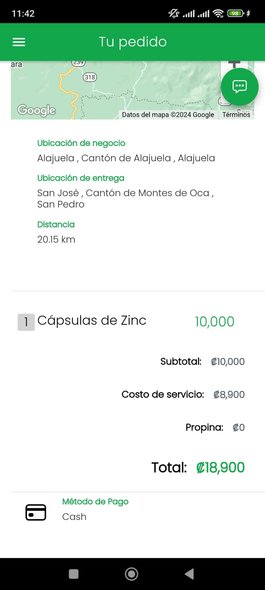
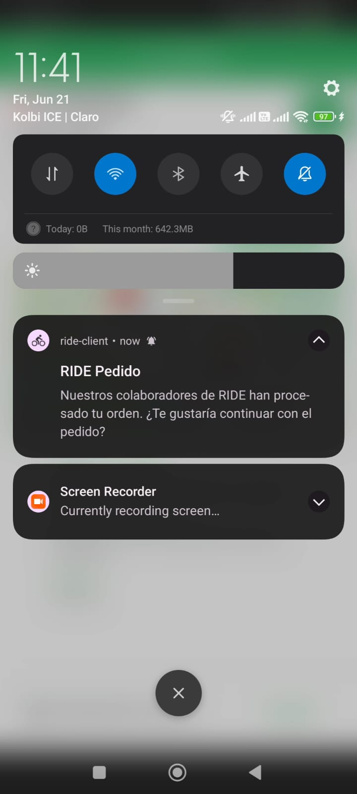
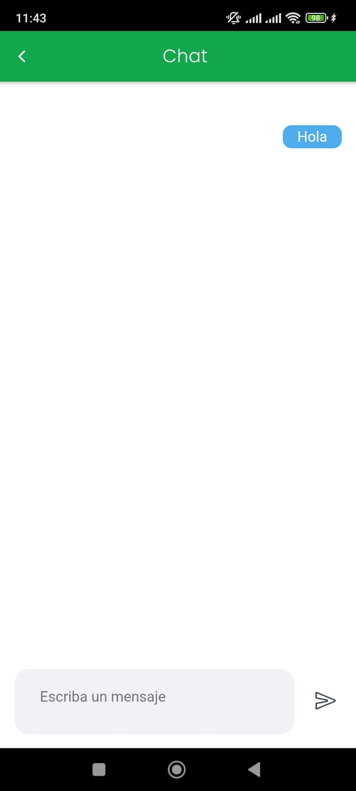
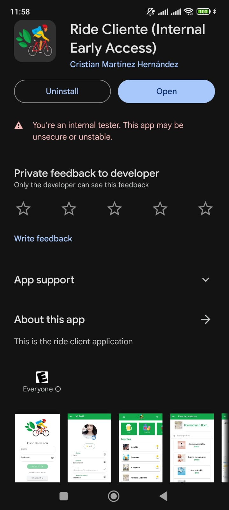

# RideClient

## Project Overview
This repository showcases the development results of a delivery application for Android during my professional practice at the University of Costa Rica, developed using Ionic and Firebase.

<table>
  <tr>
    <td align="center">
      
    </td>
     <td align="center">
      
    </td>
    <td align="center">
      
    </td>
  </tr>
</table>

## Key Features
- **Order tracking**: Combined real-time Firebase updates with Google Maps to offer users real-time order tracking.
<table>
  <tr>
    <td align="center">
      
    </td>
    <td align="center">
      
    </td>
    <td align="center">
      
    </td>
  </tr>
</table>

- **Payment methods**: Integrated two payment methods: cash and Sinpe.
<table>
  <tr>
    <td align="center">
      
    </td>
    <td align="center">
      
    </td>
  </tr>
</table>

- **Notifications - Chat**: Push notifications are implemented using Firebase Cloud Messaging. We also implemented a chat feature to facilitate communication between the biker and the client.
<table>
  <tr>
    <td align="center">
      
    </td>
    <td align="center">
      
    </td>
  </tr>
</table>

- **Play Store**: The app was published on the Play Store under early access, allowing the client to have an overview and use the app.
<table>
  <tr>
    <td align="center">
      
    </td>
  </tr>
</table>

## Demo Video
<table>
  <tr>
    <td align="center">
      
      
Click the image to watch the demo video

    </td>
  </tr>
</table>
